# Poisson image editing

An implementation of the [Poisson Image Editing](https://dl.acm.org/doi/10.1145/882262.882269) paper by Perez et al. 2003.


## Features
- Seamless cloning - importing gradients
- Seamless cloning - mixing gradients
- Seamless tiling
- Texture flattening
- Local illumination change

## Comparison with other implementations
There are many open source Python implementations of Poisson image editing. However, most implementations only focus on image *blending*, while ignoring other Poisson image editing applications listed in the paper. This implementation aims to faithfully reproduce all experiments and results presented in the paper. The following table shows the implemented functionalities:
   
||[Src. 1](https://github.com/rinsa318/poisson-image-editing)|[Src. 2](https://github.com/willemmanuel/poisson-image-editing)|[Src. 3](https://github.com/PPPW/poisson-image-editing)|This|
|--|--|--|--|--|
|Seamless cloning|✅|✅|✅|✅|
|Seamless tiling|❌|❌|❌|✅|
|Texture flattening|✅|❌|❌|✅|
|Local illumination change|❌|❌|❌|✅|

Furthermore, this implementation is signifacantly *faster* and scales much better than others. The following table shows the profiled run time of seamless cloning on different datasets (in seconds):
||[Src. 1](https://github.com/rinsa318/poisson-image-editing)|[Src. 2](https://github.com/willemmanuel/poisson-image-editing)|[Src. 3](https://github.com/PPPW/poisson-image-editing)|This|
|--|--|--|--|--|
|test1|32.064|312.930|6.755|**1.769**|
|test2|13.634|59.875|1.775|**1.389**|
|test3|36.575|565.466|3.401|**2.062**|
|test4|19.866|42.592|1.542|**1.420**|


## Usage

To run all experiments using the given datasets (contains testing images in the paper and this README file), run
```
./run_experiments.sh
```

### Seamless cloning
To test on your own dataset, run
```
python3 seamless_cloning.py --help
```

- `data_dir`: Folder that contains the input image files. The folder should contain image files named `mask`, `target`, and `source`. The file extension of the files can be arbitrary, as long as the files are valid image files.
- `grayscale`: Whether to perform blending on the grayscale images.
- `solver`: Linear solver to use when solving the poisson blending problem. The solver should be functions in the `scipy.sparse.linalg` library. Default is `spsolve`. 
- `gradient_mixing_mode`: Method to mix source and target image gradients. `max` implements *3. Seamless cloning - Mixing gradients* section in the paper, while `alpha` + `gradient_mixing_alpha == 1.0` implements *3. Seamless cloning - Importing gradients* section. 
- `gradient_mixing_alpha`: Alpha to blend source and target image gradients. Has an effect only when `gradient_mixing_mode == "alpha"`. 

### Seamless tiling
To test on your own dataset, run
```
python3 seamless_tiling.py --help
```

### Texture flattening
To test on your own dataset, run
```
python3 texture_flattening.py --help
```
- `use_edge`: Use `edge.*` edge map image file in the folder specified in the `data_dir` folder. If this flag is not set, then computes the edge map from provided source image using Canny edge detector and binary dilation.
- `canny_threshold`: Thresholding parameters for Canny edge detector. You can play with this parameter for different flattening results. See the [documentation](https://docs.opencv.org/4.x/da/d22/tutorial_py_canny.html) for more information.
- `edge_dilation_kernel`: Kernel size to dilate detected edges. The kernel is a square box filter filled with ones.

### Local illumination change
To test on your own dataset, run
```
python3 local_illumination_change.py --help
```
- `data_dir`: Folder that contains the input image files. The folder should contain image files named `mask` and `source`. The file extension of the files can be arbitrary, as long as the files are valid image files. The illumination of the regions specified by the mask will be modified.

## Results
### Seamless cloning
|Source|Target|Mask|Result|
|--|--|--|--|
|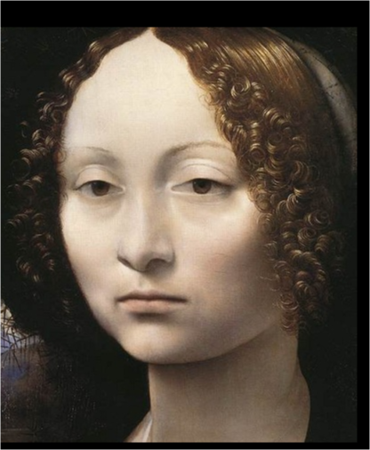|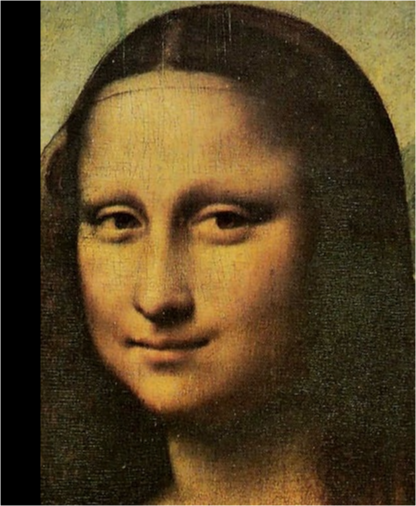|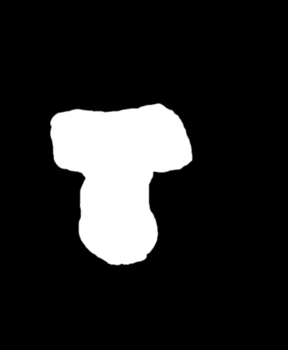||
||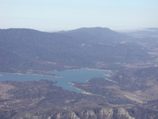|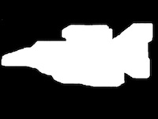||
|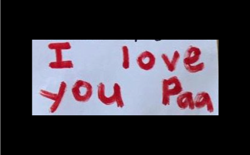|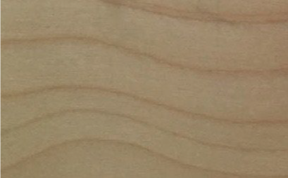|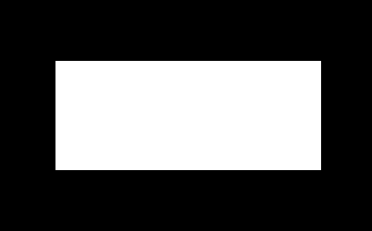|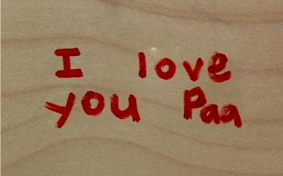|
|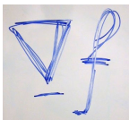|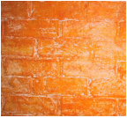|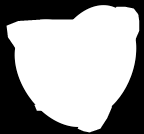|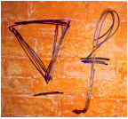|

### Seamless tiling
|Texture|Naive tile|Seamless tile|
|--|--|--|
|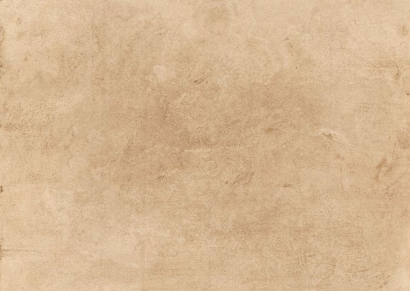|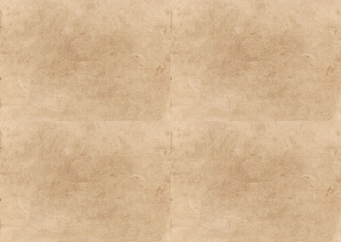|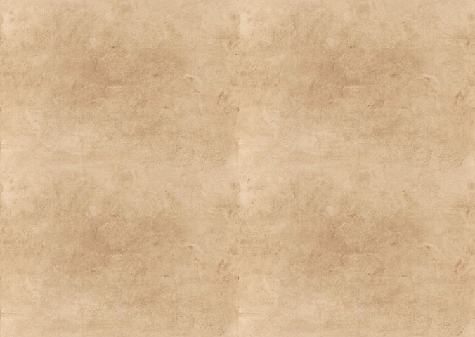|
||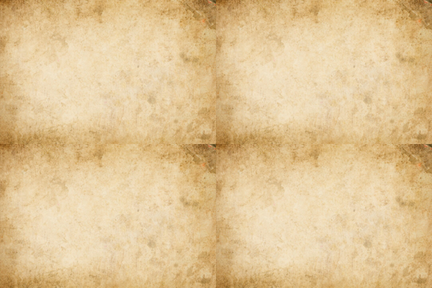|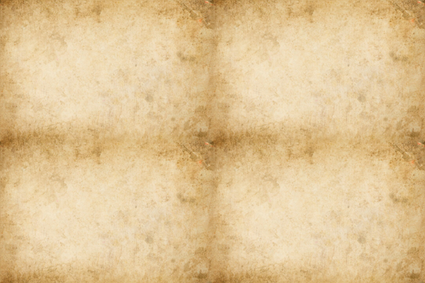|

### Texture flattening
|Source|Mask|Edge|Flattened|
|--|--|--|--|
|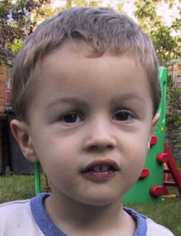|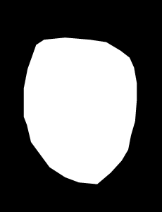|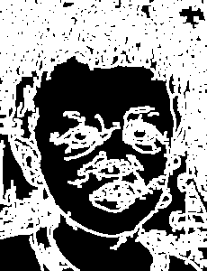|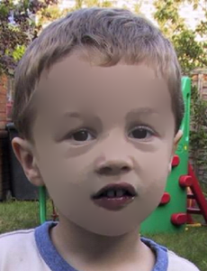|

### Local illumination change
|Source|Mask|Modified|
|--|--|--|
|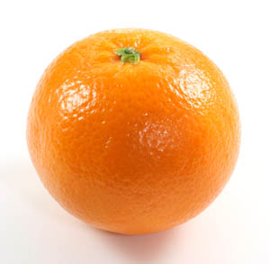|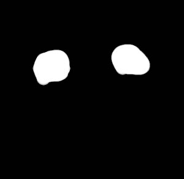|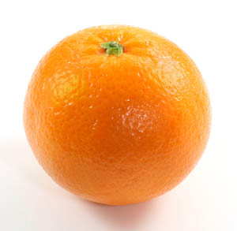|

## Notes
- Faster solvers: `spsolve`, `cgs`, `bicg`
- `minres` gives bad results.
- If you want to use conjugate gradient solvers, use `bicg`, `bicgstab` or `cgs`. Do not use `solver == "cg"` since the A matrix is not hermitian (or symmetric since A is real).
- Iterative least-squares solvers `lsqr`, `lsmr` tend to be much slower.

## Todo
- Add `PoissonEditor` base class for code reuse
- Local color changes