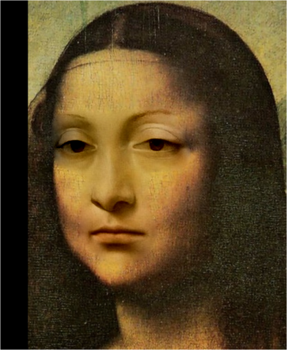
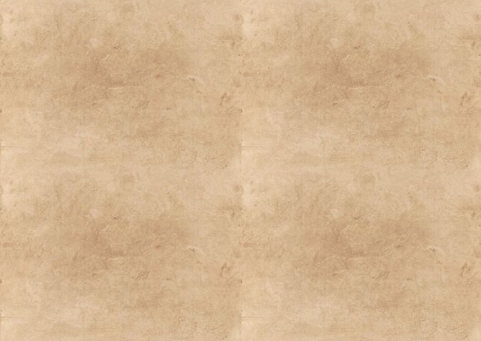

# Poisson image editing

An implementation of the [Poisson Image Editing](https://dl.acm.org/doi/10.1145/882262.882269) paper by Perez et al. 2003.

## Features
- Seamless cloning - importing gradients
- Seamless cloning - mixing gradients
- Seamless tiling

## Usage
### Seamless cloning
To test on your own dataset, run
```
python3 seamless_cloning.py --help
```

- `data_dir`: Folder that contains the input image files. The folder should contain image files named `mask`, `target`, and `source`. The file extension of the files can be arbitrary, as long as the files are valid image files.
- `grayscale`: Whether to perform blending on the grayscale images.
- `solver`: Linear solver to use when solving the poisson blending problem. The solver should be functions in the `scipy.sparse.linalg` library.
- `gradient_mixing_mode`: Method to mix source and target image gradients. `max` implements *3. Seamless cloning - Mixing gradients* section in the paper, while `alpha` + `gradient_mixing_alpha == 1.0` implements *3. Seamless cloning - Importing gradients* section. 
- `gradient_mixing_alpha`: Alpha to blend source and target image gradients. Has an effect only when `gradient_mixing_mode == "alpha"`. 
   
To run all experiments using datasets from the original paper, run
```
./run_cloning.sh
```

### Seamless tiling
To test on your own dataset, run
```
python3 seamless_tiling.py --help
```

To run all experiments using the given datasets, run
```
./run_tiling.sh
```

## Results
### Seamless cloning
|Source|Target|Mask|Result|
|--|--|--|--|
|||||
|||||
|||||
|||||

### Seamless tiling
|Texture|Naive tile|Seamless tile|
|--|--|--|
||||
||||

## Notes
- `solver == "spsolve"` gives bad results. As stated in the [documentation](https://docs.scipy.org/doc/scipy/reference/generated/scipy.sparse.linalg.spsolve.html#scipy.sparse.linalg.spsolve) of `spsolve`, the solver assumes the solution to be sparse. However, this is not our case since the transformed source field is not sparse.
- If you want to use conjugate gradient solvers, use `bicg`, `bicgstab` or `cgs`. Do not use `solver == "cg"` since the A matrix is not hermitian (or symmetric since A is real).

## Todo
- Add `PoissonEditor` base class for code reuse
- Local illumination changes
- Local color changes